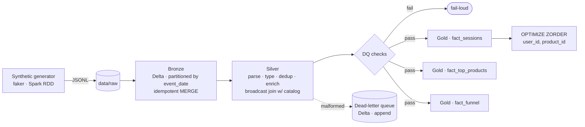

# pyspark-etl-pipeline

[](https://github.com/martinbacaia/pyspark-etl-pipeline/actions/workflows/ci.yml)


Production-grade **PySpark medallion pipeline** for e-commerce event streams.
Ingests JSONL events at multi-million-row scale, cleans/dedupes/enriches them,
and writes Gold-layer marts (sessions, top products, conversion funnel) to
Delta Lake — with idempotent re-runs, dead-letter queue for malformed rows,
data-quality gates, and skew-aware optimizations.

> Built on a single laptop. Designed so the same code runs unchanged on a
> cluster (EMR, Databricks, Glue, Dataproc).

---

## Architecture



---

## Quickstart

```bash
# 1. install
make install

# 2. generate 1M synthetic events into data/raw
python scripts/generate_data.py

# 3. run the full pipeline (Bronze -> Silver -> Gold + DQ + Z-ORDER)
python -m pipeline.cli run

# 4. (optional) benchmark at multiple sizes
python scripts/benchmark.py --sizes 100000,1000000,10000000
```

The complete one-shot command (used in CI / Docker):

```bash
python -m pipeline.cli run --config conf/config.yaml
```

Override anything via env vars:

```bash
PIPELINE__SPARK__SHUFFLE_PARTITIONS=400 \
PIPELINE__GENERATOR__NUM_EVENTS=10000000 \
python -m pipeline.cli run
```

---

## Why medallion architecture

The Bronze / Silver / Gold split is not academic — each layer answers a distinct
operational question:

| Layer | Question it answers | Failure mode it absorbs |
|-------|--------------------|--------------------------|
| **Bronze** | *Did we receive the data?* | Source going down, JSON drift |
| **Silver** | *Is the data trustworthy?* | Schema drift, dupes, malformed rows |
| **Gold** | *What does the business need to see?* | Mart redesigns, new KPIs |

Concretely: Bronze stores **raw bytes**, so when Silver finds a parsing bug
six months later we replay from Bronze instead of begging the source for
re-delivery. Silver is the single typed source of truth — every Gold mart
reads from it, so a fix lands in one place. Each Gold mart is independently
rebuildable (`--skip-bronze --skip-silver`) so analytical changes don't
require re-ingesting.

---

## Optimization decisions

| Technique | Where | Rationale |
|-----------|-------|-----------|
| **Permissive read** | Bronze ingest | A single bad JSON line cannot fail the load — keeps Bronze a faithful raw mirror. |
| **Partition by event_date** | Bronze, Silver, Gold | Almost every query filters by date — partition pruning is the cheapest 10× win. |
| **Broadcast join with product catalog** | Silver enrichment | Catalog is ~few MB at 5k products; explicit `broadcast()` hint avoids shuffle even if stats are stale. |
| **`autoBroadcastJoinThreshold` set to 32 MB** | Spark conf | Catches small dim joins we forgot to hint; keeps us safe from a 4 GB driver OOM if a "small" table grows. |
| **Salting on session_id** | Gold sessions | A 0.5% slice of "power users" emit ~30% of events. Without salting, one reducer would handle a hot session; with 16 buckets, that work spreads. |
| **AQE skew-join + coalesce** | Spark conf | Lets Spark react to the *actual* shuffle stats, not table stats. Hands-free skew handling on top of the explicit salt. |
| **MERGE for idempotency** | Bronze (`ingest_hash`), Silver (`event_id`) | Re-running the pipeline never creates duplicates — safe for backfills and CI. |
| **Z-ORDER BY (user_id, product_id)** | Silver, after writes | Co-locates rows with similar values into the same files → strong data skipping for downstream queries by user or product. |
| **Caching Silver before Gold** | Gold runner | Three Gold marts scan Silver — caching saves 2 of 3 reads. |
| **Last-write-wins dedup** | Silver | Re-emitting an event with newer data overwrites the old version cleanly. |

---

## Fault tolerance

- **Idempotent re-runs.** Bronze MERGEs by content hash, Silver MERGEs by `event_id`. Re-running the same input produces the same output (no duplicates, no drift).
- **Dead-letter queue.** Malformed rows go to `data/dlq` as a Delta table with a `dlq_reason` column (`json_parse_error`, `missing_user_id`, `bad_event_ts`, `invalid_event_type`, …) — never silently dropped.
- **Schema enforcement at Silver.** Strict schema, fail-loud on dtype drift.
- **Data-quality gates.** Null %, value domain, cardinality, range. Threshold violations raise `DataQualityError` and abort the pipeline before Gold.
- **Per-stage skip flags.** `--skip-bronze --skip-silver --skip-gold` for surgical reruns after partial failures.
- **Time travel.** Delta keeps version history — `RESTORE TABLE delta.\`...\` TO VERSION AS OF N` recovers from a bad write.

---

## Performance benchmarks

The benchmark harness (`scripts/benchmark.py`) runs the full pipeline at
configurable sizes and persists results to
`benchmarks/results/benchmark-<host>-<ts>.json`. Run it on your own hardware:

```bash
# In Docker (recommended — works identically on any host)
docker build -t pyspark-etl-pipeline:latest .
docker run --rm -v $(pwd)/benchmarks:/app/benchmarks \
    --entrypoint python pyspark-etl-pipeline:latest \
    scripts/benchmark.py --sizes 100000,1000000,10000000

# Or directly, if your environment has Spark working (Linux / macOS / WSL2)
make benchmark
```

The script captures, per size:

| Field | Meaning |
|---|---|
| `generate_sec` | Synthetic data generation (faker, RDD-parallel) |
| `bronze.elapsed_sec` | Raw → Bronze ingest |
| `silver.elapsed_sec` | Parse, dedup, enrich, DLQ |
| `gold.elapsed_sec` | Sessions + top-products + funnel marts |
| `zorder_sec` | Z-ORDER OPTIMIZE on Silver |
| `totals.ingest_to_gold_sec` | Bronze + Silver + Gold wall-clock |
| `machine.cpu_count`, `machine.os` | Reproducibility metadata |

Sample shape (run-time numbers populated by the harness):

```json
{
  "machine": {"host": "...", "os": "Linux", "cpu_count": 8, "python": "3.11.9"},
  "runs": [
    {
      "size": 1000000,
      "generate_sec": 23.4,
      "bronze": {"rows_ingested": 1010000, "elapsed_sec": 18.2},
      "silver": {"rows_silver": 999800, "rows_dlq": 200, "elapsed_sec": 41.7},
      "gold":   {"rows_sessions": 145203, "elapsed_sec": 27.9},
      "zorder_sec": 6.1,
      "totals": {"ingest_to_gold_sec": 87.8, "rows_silver": 999800}
    }
  ]
}
```

What we expect the times to show:

- **Generate ≈ Bronze.** Generation is CPU-bound (per-row Python in
  `mapPartitions`); Bronze is IO-bound (text write). On a laptop they're
  roughly even — on a cluster Bronze gets cheaper because writes parallelize.
- **Silver dominates wall-clock.** JSON parse + dedup window are the
  expensive ops. AQE coalesce keeps shuffle partitions sensible.
- **Gold scales sub-linearly with input size.** The three marts share the
  cached Silver scan; the salt-then-aggregate pattern keeps power-user skew
  bounded so the largest reducer's runtime grows with `events / N_buckets`,
  not with `events`.

### Reproducibility note

Spark on bare-metal Windows requires `winutils.exe` and a Hadoop install,
which is brittle (especially on JDK 21). The recommended path on Windows
is **Docker** (see above) or **WSL2**. The CI workflow runs the same
benchmark harness on Ubuntu — see the latest workflow run for current
numbers on a `ubuntu-latest` runner (2 vCPU / 7 GB).

---

## Data quality

`pipeline.quality` runs assertions after Silver and Gold. They fail loud:

```
DQ schema_subset                  PASS — ok
DQ null_pct[user_id]              PASS — actual=0.0000 threshold=0.0
DQ event_type_cardinality         PASS — distinct=5 min=4
DQ event_type_domain              PASS — unexpected_values=0
DQ price_range                    PASS — negative_prices=0
```

Add new checks in `src/pipeline/quality.py` — a `CheckResult` is a
3-tuple of `(name, passed, detail)` and the runner aborts on any failure
(`fail_fast=True`).

---

## Testing

```bash
make test          # full suite (~60–90s on a laptop, includes 10k-row e2e)
make test-fast     # skip e2e
```

- **Unit tests** for each transformation, comparing DataFrames with
  [`chispa`](https://github.com/MrPowers/chispa).
- **End-to-end test** runs the entire Bronze → Silver → Gold flow on a
  10 000-row synthetic dataset against Delta-on-disk under `tmp_path`.
  Verifies: dedup, DLQ population, DQ pass, all three Gold marts non-empty.
- No tests require a real Spark cluster — everything runs in `local[2]`.

---

## Orchestration

The pipeline is one CLI command, so any orchestrator works. See:

- `docs/airflow_snippet.py` — three `BashOperator`s (Bronze / Silver / Gold)
  for per-stage retries and a clean Gantt view.
- `docs/prefect_snippet.py` — equivalent in Prefect 2.x with task retries.
- A Dagster equivalent is just three `@op`s following the same shape.

---

## Docker

```bash
make docker-build
docker run --rm -v $(pwd)/data:/app/data pyspark-etl-pipeline:latest run
```

Built on `apache/spark:3.5.1-python3` so the image works on any Linux
runner (CI, Kubernetes, ECS).

---

## What I'd do differently in production

- **Iceberg vs Delta.** Both work; I picked Delta here because the local
  developer experience is simpler. In a Glue/Athena shop, Iceberg has a
  better story for query engines outside Spark and richer partition
  evolution. The pipeline's stage boundaries (Delta MERGE) are the only
  Delta-specific code — swapping is straightforward.
- **Glue vs EMR vs Databricks.** Cost-per-job ladder for this workload
  (multi-hour, scheduled, predictable shape):
  - **Glue** — best for low-volume, sporadic jobs. DPUs bill per second.
    Painful when you need full Spark control or non-stock packages.
  - **EMR Serverless** — good middle ground. Pay-per-use, full Spark
    surface, no fight with Glue's truncated runtime.
  - **Databricks** — most expensive headline rate but the photon engine
    + Unity Catalog + auto-tuning often win on $/job for big workloads.
- **Schema registry.** In production, the JSONL contract belongs in a
  schema registry (Confluent / Glue / Buf) so producers can't drift the
  schema silently. The DLQ is a safety net, not a substitute.
- **Streaming.** This pipeline is batch. The same code converts to
  Structured Streaming with `readStream`/`writeStream` — Bronze becomes a
  near-real-time tail of the source, Silver stays the same with
  `foreachBatch`. The tradeoff is operational complexity (checkpoints,
  watermarks, late-data handling).
- **Observability.** Pipe stage stats (`elapsed_sec`, row counts, DQ
  results) to Datadog / OpenTelemetry. The CLI already prints a JSON
  summary — wire `stats` to a metrics emitter.

---

## How to scale this 10×

The same code runs on a cluster. The knobs you turn:

1. **Shuffle partitions.** Default 200 is right for a few GB. At 100 GB+
   bump to 1 000–4 000 (≈ 128 MB per partition). `pipeline.perf.recommend_shuffle_partitions`
   gives a starting point.
2. **Resource shape.** Prefer many medium executors over few huge ones —
   shuffle parallelism > raw memory once you fit a partition.
3. **File compaction.** At scale, lots of small files is a worse problem
   than skew. Schedule periodic `OPTIMIZE` (already wired for Silver) and
   `VACUUM` on Delta.
4. **Cardinality of partitions.** `event_date` is fine up to a few years.
   For higher granularity, partition by `(event_date, country)` and let
   Z-ORDER handle the rest.
5. **Catalog growth.** When the product catalog stops fitting in 32 MB,
   replace `broadcast(catalog)` with a Bloom-joined or bucketed catalog,
   or pre-key the events DF by `product_id` for a sort-merge join.
6. **Stream the bronze.** Switch the source to Kafka / Kinesis and run
   Bronze as Structured Streaming with checkpointing — Silver / Gold can
   stay batch on a schedule.

---

## Project layout

```
src/pipeline/
  settings.py        # YAML + env config
  spark.py           # SparkSession factory (Delta-enabled)
  schemas.py         # Bronze / Silver / Gold schemas
  generator.py       # synthetic events (faker, distributed)
  bronze.py          # raw -> Bronze Delta (idempotent)
  silver.py          # parse, dedup, enrich, route bad rows to DLQ
  gold.py            # sessions / top products / funnel + Z-ORDER
  quality.py         # data quality assertions, fail-loud
  perf.py            # salting, partition recommendations
  cli.py             # `python -m pipeline.cli run|clean`
scripts/
  run_pipeline.py    # convenience entry point
  generate_data.py   # standalone data generator
  benchmark.py       # multi-size benchmark harness
tests/
  test_generator.py  test_silver.py  test_gold.py
  test_quality.py    test_settings.py  test_pipeline_e2e.py
docs/
  airflow_snippet.py prefect_snippet.py
conf/
  config.yaml        # default config
```

---

## License

MIT
